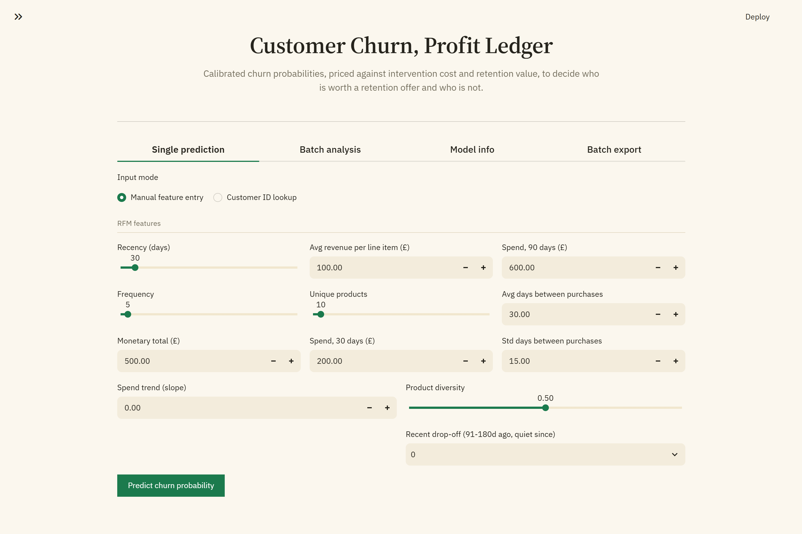
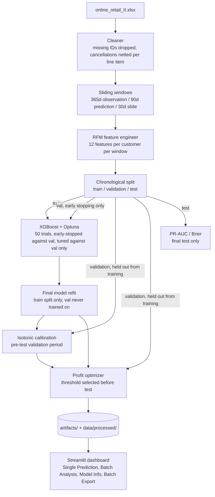

# Customer Churn Prediction with Profit Optimization

Given a customer transaction history, this pipeline predicts churn probability, calibrates it into a true probability, and turns that into a per-customer INTERVENE / DO NOT INTERVENE call based on whether the expected financial gain of a retention offer exceeds its cost, never a raw probability cutoff alone.

Built entirely on free, open infrastructure: the public [Online Retail II](https://archive.ics.uci.edu/dataset/502/online+retail+ii) dataset, open-source libraries (XGBoost, Optuna, scikit-learn, Streamlit), no paid APIs, no GPU required.

## Preview

<p align="center">
  
  <br>
  <sub>Single Prediction, manual feature entry: Main landing UI</sub>
</p>

Additional screenshots in [`assets/`](assets/), one per tab/feature.

## What this is

Given the raw transaction file, the pipeline:

1. Cleans it, drops rows with no customer ID, nets cancellations against the specific line item they credit (not the whole invoice), keeps only positive quantities and prices.
2. Builds sliding observation/prediction windows per customer, so the same customer contributes multiple labeled examples across different points in time, not one static snapshot.
3. Engineers 12 RFM-based features per customer per window, and labels churn by whether the customer bought again in the following 90 days.
4. Tunes XGBoost on an earlier chronological validation period, calibrates on that pre-test validation period, selects the profit threshold there, and reports final metrics once on a later test period.
5. Sweeps decision thresholds to find the one that maximizes net campaign profit, not the one that maximizes accuracy.
6. Serves all of this through a Streamlit dashboard: single-customer lookup, batch scoring, and a downloadable intervention list, every recommendation traceable back to the expected-value formula behind it.

## Architecture



`scripts/check_threshold_floor.py` runs a reduced path through this same architecture: it reloads the saved model and calibrator, reproduces the identical chronological train/validation/test split (deterministic given the fixed `RANDOM_SEED`), and re-sweeps thresholds alone, skipping cleaning, windowing, feature engineering, and tuning entirely. That's only possible because the split is reproducible by construction, not incidental.

## Expected Value Framework

```
E[Profit] = P(churn) * (intervention_success_rate * avg_monthly_spend * 3 months) - intervention_cost
```

`avg_monthly_spend` is each customer's `monetary_total` (revenue across the full 12-month observation window) divided by the number of months that window spans, computed once by `compute_avg_monthly_spend()` in `src/evaluation/profit_optimizer.py` and used identically during training and at serving time, never two different figures for the same concept in different places.

A customer is targeted only when expected profit is positive. A customer with a high churn probability but low monthly spend can still be correctly flagged DO NOT INTERVENE, because the expected return doesn't clear the intervention cost. This is the core difference from thresholding on probability alone.

## Models

| Role | Model | Library | Notes |
|---|---|---|---|
| Churn classifier | XGBoost (`XGBClassifier`) | `xgboost` | Trained on the natural class imbalance. No SMOTE, no `scale_pos_weight`; post-hoc calibration corrects score distortion instead. The final model fits on the train split only, never on validation, so validation stays genuinely held out for calibration and threshold selection. |
| Hyperparameter search | TPE sampler (Optuna's default) | `optuna` | 50 trials, objective is validation-set PR-AUC, with `early_stopping_rounds` and `eval_metric="aucpr"` wired to that same validation set so trials actually stop early instead of training to the full suggested `n_estimators` regardless of validation performance. Never sees the test set, by construction (see Guardrails). |
| Calibration | Isotonic regression | `scikit-learn` | Default; Platt scaling (`LogisticRegression`) is available via `CALIBRATION_METHOD` in `config.py`. Fit on the pre-test validation period, converting raw scores into probabilities used by the profit formula. |
| Explainability | SHAP `TreeExplainer` | `shap` | Per-customer waterfall plot in the dashboard only. Never touches training, tuning, or thresholding. |

The evaluation protocol keeps every decision ahead of the final test period: hyperparameters, calibration, and threshold selection all happen before the final test period, using the validation period. The final chronological test period is used only after those choices are locked.

## Guardrails

- **Split integrity is asserted, not assumed.** `temporal_train_val_test_split()` (`src/modeling/trainer.py`) asserts chronological ordering and non-overlapping partitions; regression coverage lives in `tests/test_temporal_split.py`.
- **The final test set is not used for model selection.** Calibration and threshold selection happen on the pre-test validation period. The test period is used only for final metrics and locked-strategy evaluation.
- **Calibration and thresholding run against data the final model never trained on.** `train_model()` fits the shipped model on the train split only; validation is never folded into that fit. `scripts/run_pipeline.py` records `final_model_trained_on: "train_only"` in `split_metadata.pkl`, and `tests/test_no_calibration_leakage.py` pins this behavior with a regression test that inspects every `XGBClassifier.fit()` call the training path makes. This used to not be true, an earlier version of `train_model()` refit the final model on `train + val` and then calibrated and thresholded against that same `val`, see the bug log at the bottom of this file.
- **Cancellation netting is scoped, not global.** A cancellation only decrements the specific `(invoice, stockcode)` it matches, verified against duplicate-line-item and multi-cancellation edge cases in `tests/test_cleaner.py`, not just the common case.
- **Graceful degradation on missing artifacts.** Every dashboard tab checks for its required model/data files before using them and shows a clear "run the pipeline first" message instead of a raw traceback.
- **Graceful degradation on a zero or negative baseline.** The profit-lift calculation in Batch Analysis falls back to an absolute currency delta instead of dividing by zero or reporting a nonsensical percentage over a negative base.

## Artifacts

`scripts/run_pipeline.py` persists everything the dashboard needs to `artifacts/` (`xgb_model.pkl`, `calibrator.pkl`, `feature_names.pkl`, `calibration_method.pkl`, `optimal_threshold.pkl`, `metrics.pkl`, `split_metadata.pkl`) and `data/processed/` (`feature_matrix.pkl`, `profit_comparison.csv`, `threshold_analysis.csv`). `app/app.py` only ever reads these; it never retrains.

Re-running the pipeline overwrites all of the above in place. There's no versioning and no run history kept, if you want to compare two configurations, save a copy of `data/processed/` and `artifacts/` before re-running with different `config.py` values.

## Data Integrity

Cancellation matching assumes a credit note's invoice number is the original sale's invoice number with a `C` prefix, since that's the convention this specific dataset follows. This is a mitigation for a known messy-data pattern, not a guarantee: a refund that doesn't follow the convention is simply left unmatched and passes through as a separate negative-quantity row removed by the `quantity > 0` filter. It understates netted revenue in that case rather than corrupting an unrelated row, which was the actual bug this replaced (see the bug log at the bottom of this file).

## Dataset

[Online Retail II (UCI)](https://archive.ics.uci.edu/dataset/502/online+retail+ii): 1,067,371 raw transactional records from a UK-based online retailer spanning December 2009 to December 2011, combined across both sheets (`Year 2009-2010`, `Year 2010-2011`) in the source `.xlsx`. `src/data/cleaner.py` loads and concatenates both (`load_raw_data`).

The post-cleaning row count isn't hardcoded here since it depends on the actual file in `data/raw/`; `scripts/run_pipeline.py` prints it as `Cleaned transactions: <n>`.

## Project Structure

```
churn-profit-opt/
│
├── .streamlit/config.toml            # Explicit theme, so the app doesn't depend on OS/browser dark-mode

├── config.py                    # All constants, paths, financial parameters
├── requirements.txt
├── .gitignore
├── README.md
│
├── scripts/
│   ├── run_pipeline.py             # End-to-end training and evaluation script
│   └── check_threshold_floor.py    # Reuses saved artifacts to re-sweep thresholds without retraining
│
├── src/
│   ├── data/
│   │   ├── cleaner.py              # Missing ID removal, invoice+stockcode cancellation netting
│   │   └── temporal.py             # Sliding window generator
│   ├── features/
│   │   └── rfm_engineer.py         # RFM + extensions computed per window
│   ├── modeling/
│   │   ├── trainer.py              # XGBoost with early-stopped Optuna tuning; final model fits on train only
│   │   └── calibrator.py           # Platt scaling / Isotonic regression
│   └── evaluation/
│       ├── metrics.py              # PR-AUC, Brier score
│       ├── profit_optimizer.py     # Expected value maximization and baselines
│       └── explainability.py       # SHAP TreeExplainer wrapper used by the dashboard
│
├── app/app.py                      # Streamlit interactive dashboard
│
├── tests/
│   ├── test_temporal.py                  # sliding window boundaries + churn label correctness
│   ├── test_rfm_engineer.py              # RFM aggregation math, seasonal_dropoff across all calendar months
│   ├── test_profit_optimizer.py          # threshold sweep, argmax, compute_avg_monthly_spend scaling
│   ├── test_temporal_split.py            # chronological ordering and split integrity
│   ├── test_cleaner.py                   # cancellation netting, duplicate line items, multi-cancellation sums
│   └── test_no_calibration_leakage.py    # final model is fit on train only, never on validation
│
├── data/
│   ├── raw/                        # Place online_retail_II.xlsx here
│   └── processed/                  # Generated feature matrices and results
│
├── artifacts/                      # Serialized model, calibration, threshold, and evaluation artifacts
└── assets/                         # Dashboard assets for README
```

## Getting started

1. **Get the dataset:** download `online_retail_II.xlsx` from the [UCI repository](https://archive.ics.uci.edu/dataset/502/online+retail+ii) and place it in `data/raw/`.

2. **Install:**
   ```bash
   git clone <repo-url>
   cd churn-profit-opt
   python -m venv venv
   source venv/bin/activate  # or venv\Scripts\activate on Windows
   pip install -r requirements.txt
   ```

3. **Review `config.py` (optional).** You don't need to touch it for a first run, but every financial and windowing assumption lives there:

   | Parameter | Default | Description |
   |---|---|---|
   | `OBSERVATION_WINDOW_DAYS` | 365 | Length of observation window |
   | `PREDICTION_WINDOW_DAYS` | 90 | Churn lookahead period |
   | `SLIDE_INTERVAL_DAYS` | 30 | Step size for sliding windows |
   | `COST_OF_OFFER` | 10.0 | Cost per retention intervention (£) |
   | `INTERVENTION_SUCCESS_RATE` | 0.15 | Fraction of churners who accept the offer |
   | `MONTHS_REVENUE_SAVED` | 3 | Revenue horizon if customer is retained |
   | `OPTUNA_TRIALS` | 50 | Number of hyperparameter search trials |
   | `CALIBRATION_METHOD` | isotonic | isotonic or platt |
   | `VALIDATION_SIZE` | 0.2 | Fraction of chronological windows used before the final test period |
   | `TEST_SIZE` | 0.2 | Final chronological test fraction |

## Running it

```bash
python scripts/run_pipeline.py     # cleans, tunes, calibrates, selects threshold, evaluates, and saves artifacts
pytest tests/ -v                   # 33 tests, offline, small synthetic fixtures, no dataset needed
streamlit run app/app.py           # dashboard; needs the artifacts from the pipeline run above
```

The dashboard has four tabs. **Single Prediction** takes manual RFM input or a customer ID lookup and returns a four-stat result row (churn probability, expected profit, the INTERVENE/DO NOT INTERVENE call, revenue at stake) alongside a SHAP explanation. **Batch Analysis** compares net profit across random, default-threshold, and profit-optimized strategies, with the full threshold sweep charted. **Model Info** documents the architecture, every feature, and the profit formula in one place. **Batch Export** scores every customer at once and produces a downloadable intervention list, each row carrying its own financial justification, plus the full scored dataset for CRM or campaign-tool import.

## Evaluation

Evaluation here means two different things, and this project doesn't blur them: whether the code is correct (unit tests), and whether the model is actually good (held-out metrics). Conflating them is how leakage bugs like the one below hide for a while.

- **Unit tests** (`tests/`, `pytest tests/ -v`) run offline against small synthetic fixtures and check code correctness, not model quality: sliding-window boundaries, RFM aggregation math, the profit formula's arithmetic, cancellation-netting edge cases, split disjointness, and (as of the bug log entry below) that the final model is never fit on the rows used to calibrate or threshold it. 33 tests total, see the file-by-file breakdown in [Project Structure](#project-structure).
- **Model quality** is PR-AUC, Brier score, and net profit, computed once on the held-out test split described in Models and Guardrails above, using `scripts/run_pipeline.py`. PR-AUC rather than ROC-AUC on purpose: ROC-AUC inflates performance on class-imbalanced data like this by rewarding correct ranking of the abundant negative class.
- **Those numbers, on the real dataset:**

  | Metric | Value |
  |---|---|
  | PR-AUC (final temporal test) | generated by the pipeline |
  | Brier score (final temporal test) | generated by the pipeline |
  | Locked profit threshold | selected on threshold-selection split |

  The exact figures are intentionally generated at runtime. They will change with the data snapshot, random seed, temporal boundaries, model configuration, and financial assumptions. `scripts/check_threshold_floor.py` rechecks the threshold sweep on the dedicated threshold-selection period without touching the final test period, and it also checks `split_metadata.pkl` to confirm the model that produced those artifacts was trained on the train split alone. That's still a determinism and provenance check, not a substitute for the dedicated leakage regression test in `tests/test_no_calibration_leakage.py`, reproducing a sweep proves the sweep is stable given its inputs, it doesn't independently prove those inputs were leak-free.


## Known limitations

- Cancellation matching's `C`-prefix convention is a mitigation, not a guarantee; see Data Integrity above.
- Temporal evaluation gives up customer-disjoint partitions because the same customer can legitimately be observed at earlier and later forecast times. The final test period is strictly later than the training and validation periods.
- `monetary_avg` is mean revenue per transaction line item, not per order/invoice; the dashboard labels it explicitly to avoid implying true average order value.
- The intervention success rate is a configurable constant, not a learned parameter; in production this would come from A/B testing.
- Cold-start customers with no transaction history cannot be scored.
- The locked global threshold shown in Batch Analysis is selected on a dedicated earlier period and is used only for the baseline comparison table; individual scoring decisions still use per-customer expected value.

## Bug log

**Calibration and threshold selection leaked into the final model's own training data.** `train_model()` tuned hyperparameters correctly (Optuna's objective only ever saw `X_train`/`X_val`), but then refit the final shipped model on `X_train` concatenated with `X_val`. `run_pipeline.py` then fit the calibrator and selected the profit threshold using `model.predict_proba(X_val)`, the same `X_val` that model had just trained on. The final PR-AUC/Brier numbers were unaffected, `X_test` was never touched by anything upstream of the final evaluation step, but the calibrator and the locked decision threshold, the two pieces that turn a raw score into an actual INTERVENE/DO NOT INTERVENE call, were both fit against optimistic, in-sample scores rather than genuine held-out generalization.

Fix: the final model now fits on `X_train` alone. `X_val` stays genuinely unseen by that model and is used only for calibration and threshold selection, exactly the way the README's own stated evaluation protocol always claimed it worked. As a side effect of no longer relying on validation data to pad out the final training set, the Optuna objective now uses real early stopping (`early_stopping_rounds` + `eval_metric="aucpr"`, both previously accepted as no-op-adjacent constructor arguments that had no `early_stopping_rounds` to actually trigger on), and the final model's `n_estimators` is set to the best trial's actual early-stopped iteration count rather than the raw suggested upper bound. `tests/test_no_calibration_leakage.py` pins this by spying on every `XGBClassifier.fit()` call `train_model()` makes and asserting the final call trains on exactly `len(X_train)` rows, never `len(X_train) + len(X_val)`.

This replaced the cancellation-matching bug referenced above in Data Integrity, an earlier version of the netting logic in `src/data/cleaner.py` matched a cancellation to the wrong `(invoice, stockcode)` pair in cases with duplicate line items, corrupting an unrelated row's quantity rather than just leaving a non-conforming refund unmatched. The current row-scoped `(invoice, customer_id, stockcode)` merge in `clean_data()`, and the duplicate-line and multi-cancellation regression tests in `tests/test_cleaner.py`, are what replaced it.
