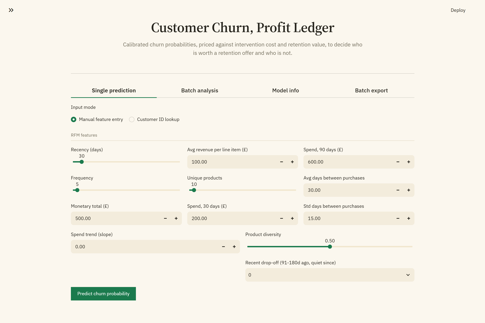
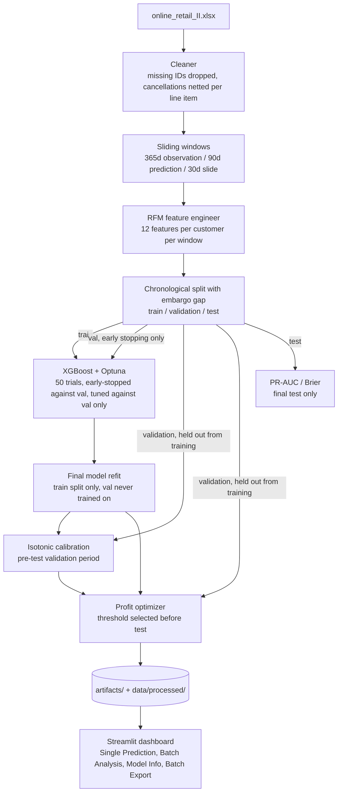

# Customer Churn Prediction with Profit Optimization

Given a customer transaction history, this pipeline predicts churn probability, calibrates it into a true probability, and turns that into a per-customer INTERVENE / DO NOT INTERVENE call based on whether the expected financial gain of a retention offer exceeds its cost, never a raw probability cutoff alone.

Built entirely on free, open infrastructure: the public [Online Retail II](https://archive.ics.uci.edu/dataset/502/online+retail+ii) dataset, open-source libraries (XGBoost, Optuna, scikit-learn, Streamlit), no paid APIs, no GPU required.

## Preview

<p align="center">
  
  <br>
  <sub>Single Prediction, manual feature entry: Main landing UI</sub>
</p>

Screenshots are not committed in this snapshot; see [`assets/README.md`](assets/README.md). The dashboard does not require them to run.

## What this is

Given the raw transaction file, the pipeline:

1. Cleans it, drops rows with no customer ID, nets cancellations against the specific line item they credit (not the whole invoice), keeps only positive quantities and prices.
2. Builds sliding observation/prediction windows per customer, so the same customer contributes multiple labeled examples across different points in time, not one static snapshot.
3. Engineers 12 RFM-based features per customer per window, and labels churn by whether the customer bought again in the following 90 days.
4. Splits windows chronologically with an embargo gap around each split boundary, tunes XGBoost on an earlier chronological validation period, calibrates on that pre-test validation period, selects the profit threshold there, and reports final metrics once on a later test period.
5. Sweeps decision thresholds to find the one that maximizes net campaign profit, not the one that maximizes accuracy.
6. Serves all of this through a four-tab Streamlit dashboard (Single Prediction, Batch Analysis, Model Info, Batch Export): single-customer lookup, profit strategy comparison, model documentation, and batch scoring with a downloadable intervention list, every recommendation traceable back to the expected-value formula behind it.

## Architecture


```mermaid
flowchart TD
    raw[online_retail_II.xlsx] --> clean[Cleaner\nmissing IDs dropped, cancellations netted per line item]
    clean --> windows[Sliding windows\n365d observation / 90d prediction / 30d slide]
    windows --> features[RFM feature engineer\n12 features per customer per window]
    features --> split[Chronological split with embargo gap\ntrain / validation / test]
    split -->|train| tune[XGBoost + Optuna\n50 trials, early-stopped against val, tuned against val only]
    split -->|val, early stopping only| tune
    tune --> finalfit[Final model refit\ntrain split only, val never trained on]
    split -->|validation, held out from training| calibrate[Isotonic calibration\npre-test validation period]
    finalfit --> calibrate
    finalfit --> profit[Profit optimizer\nthreshold selected before test]
    split -->|validation, held out from training| profit
    split -->|test| metrics[PR-AUC / Brier\nfinal test only]
    calibrate --> profit
    profit --> artifacts[(artifacts/ + data/processed/)]
    artifacts --> dashboard[Streamlit dashboard\nSingle Prediction, Batch Analysis, Model Info, Batch Export]
```

`scripts/check_threshold_floor.py` runs a reduced path through this same architecture: it reloads the saved model and calibrator, reproduces the identical chronological train/validation/test split, and re-sweeps thresholds alone, skipping cleaning, windowing, feature engineering, and tuning entirely. The split is a pure function of the sorted window dates, `VALIDATION_SIZE`, `TEST_SIZE`, and `EMBARGO_DAYS`; it involves no randomness, so `RANDOM_SEED` has no effect on it. The script verifies the recorded `embargo_days` and validation row count against the saved `split_metadata.pkl` before trusting the reproduction.

## Results

Produced by `scripts/run_pipeline.py` on the full Online Retail II file and written into this section by `scripts/update_readme_results.py`. Numbers change with the data snapshot, seed, windowing, and financial assumptions in `config.py`.

| Metric | Value |
|---|---|
| PR-AUC (final temporal test) | 0.7385 |
| Brier score (final temporal test) | 0.2036 |
| Locked profit threshold (selected on validation) | 0.05 |

Split sizes (embargo of 90 days at each boundary):

| Split | Rows | Share |
|---|---|---|
| Train | 8,497 | 19.8% |
| Validation | 4,334 | 10.1% |
| Test | 4,334 | 10.1% |
| Purged by embargo | 25,843 | 60.1% |

Profit comparison on the final test set:

| Strategy | Total Interventions | True Positives | Wasted Spend (FP) | Net Campaign Profit |
|---|---|---|---|---|
| Random (20%) | 866 | 429 | 437 | £6,380 |
| Default Threshold (0.5) | 2944 | 1916 | 1028 | £14,572 |
| Profit-Optimized | 4130 | 2204 | 1926 | £27,001 |

Generated by `scripts/update_readme_results.py` from the artifacts of the last `scripts/run_pipeline.py` run. Re-run both after changing the data, seed, windowing, or financial assumptions.

**Observations**

- Roughly half of test customers churn (the random 20% baseline hit 429 churners in 866 picks), so a PR-AUC of 0.7385 is a lift over a base rate near 0.5, not over a rare-event rate. A constant 0.5 forecast scores a Brier of 0.25 against 0.2036 here, so the probabilities are informative but not sharp.
- The locked threshold of 0.05 flags 4,130 of 4,334 test customers (about 95%). With a 10 pound cost, 15% success rate, and 3 months of spend, most customers clear the cost hurdle even at low churn probability, so the profit-optimal policy is close to blanket targeting. Its gain over the 0.5 cutoff (27,001 vs 14,572 pounds) comes mainly from contacting more people, not from sharper selection.
- A contact-everyone baseline is not in the comparison, so the model's added value over blanket targeting is not measured here.
- The test set is consistent with a single window (4,334 rows), so profit figures are a single-period estimate with no confidence interval. The embargo also leaves only about 20% of rows for training.

## Expected Value Framework

```
E[Profit] = P(churn) * (intervention_success_rate * avg_monthly_spend * 3 months) - intervention_cost
```

`avg_monthly_spend` is each customer's `monetary_total` (revenue across the full 12-month observation window) divided by the number of months that window spans, computed once by `compute_avg_monthly_spend()` in `src/evaluation/profit_optimizer.py` and used identically during training and at serving time, never two different figures for the same concept in different places.

A customer is targeted only when expected profit is positive. A customer with a high churn probability but low monthly spend can still be correctly flagged DO NOT INTERVENE, because the expected return doesn't clear the intervention cost. This is the core difference from thresholding on probability alone.

## Models

| Role | Model | Library | Notes |
|---|---|---|---|
| Churn classifier | XGBoost (`XGBClassifier`) | `xgboost` | Trained on the natural class imbalance. No SMOTE, no `scale_pos_weight`; post-hoc calibration corrects score distortion instead. The final model fits on the train split only, never on validation, so validation stays genuinely held out for calibration and threshold selection. |
| Hyperparameter search | TPE sampler (Optuna's default) | `optuna` | 50 trials, objective is validation-set PR-AUC, with `early_stopping_rounds` and `eval_metric="aucpr"` wired to that same validation set so trials actually stop early instead of training to the full suggested `n_estimators` regardless of validation performance. Never sees the test set, by construction (see Guardrails). |
| Calibration | Isotonic regression | `scikit-learn` | Default; Platt scaling (`LogisticRegression`) is available via `CALIBRATION_METHOD` in `config.py`. Fit on the pre-test validation period, converting raw scores into probabilities used by the profit formula. |
| Explainability | SHAP `TreeExplainer` | `shap` | Per-customer waterfall plot in the dashboard only. Never touches training, tuning, or thresholding. |

The evaluation protocol keeps every decision ahead of the final test period: hyperparameters, calibration, and threshold selection all happen before the final test period, using the validation period. The final chronological test period is used only after those choices are locked.

## Guardrails

- **Split integrity is asserted.** `temporal_train_val_test_split()` (`src/modeling/trainer.py`) checks chronological order, disjoint partitions, and the embargo gap. Covered by `tests/test_temporal_split.py`.
- **Embargoed boundaries.** Labels look 90 days ahead but windows slide every 30, so neighbouring windows across a boundary would share label-defining transactions. `EMBARGO_DAYS` (default 90) reserves a band of windows at each boundary that belongs to no split. Purged row count is stored in `split_metadata.pkl`.
- **Validation stays held out.** The final model fits on the train split only. Calibration and threshold selection use validation, and the test period is used once, after both are locked. `tests/test_no_calibration_leakage.py` inspects every `XGBClassifier.fit()` call to enforce this, and `split_metadata.pkl` records `final_model_trained_on: "train_only"`.
- **Scoped cancellation netting.** A cancellation only reduces the `(invoice, stockcode)` it matches, tested against duplicate-line and multi-cancellation cases in `tests/test_cleaner.py`.
- **One seed source.** Optuna, XGBoost, and the random baseline all read `RANDOM_SEED` from `config.py`. The baseline uses a local `RandomState` and does not touch global numpy state.
- **Fails soft in the dashboard.** Missing artifacts show a "run the pipeline first" message, a missing icon falls back to a text icon, and profit lift falls back to an absolute delta when the baseline is zero or negative.

## Artifacts

`scripts/run_pipeline.py` persists everything the dashboard needs to `artifacts/` (`xgb_model.pkl`, `calibrator.pkl`, `feature_names.pkl`, `calibration_method.pkl`, `optimal_threshold.pkl`, `metrics.pkl`, `split_metadata.pkl`) and `data/processed/` (`feature_matrix.pkl`, `profit_comparison.csv`, `threshold_analysis.csv`). `app/app.py` only ever reads these; it never retrains.

Re-running the pipeline overwrites all of the above in place. There's no versioning and no run history kept, if you want to compare two configurations, save a copy of `data/processed/` and `artifacts/` before re-running with different `config.py` values.

## Data Integrity

Cancellation matching assumes a credit note's invoice number is the original invoice number with a `C` prefix, which is the convention in this dataset. A refund that does not follow it is left unmatched and removed by the `quantity > 0` filter, so netted revenue is understated in that case rather than an unrelated row being corrupted.

## Dataset

[Online Retail II (UCI)](https://archive.ics.uci.edu/dataset/502/online+retail+ii): 1,067,371 raw transactional records from a UK-based online retailer spanning December 2009 to December 2011, combined across both sheets (`Year 2009-2010`, `Year 2010-2011`) in the source `.xlsx`. `src/data/cleaner.py` loads and concatenates both (`load_raw_data`).

The post-cleaning row count isn't hardcoded here since it depends on the actual file in `data/raw/`; `scripts/run_pipeline.py` prints it as `Cleaned transactions: <n>`.

## Project Structure

```
churn-profit-opt/
│
├── .streamlit/config.toml       # Explicit theme, so the app doesn't depend on OS/browser dark-mode
├── config.py                    # All constants, paths, financial parameters
├── requirements.txt
├── .gitignore
├── README.md
│
├── scripts/
│   ├── run_pipeline.py             # End-to-end training and evaluation script
│   ├── check_threshold_floor.py    # Reuses saved artifacts to re-sweep thresholds without retraining
│   └── update_readme_results.py    # Writes latest metrics and profit comparison into the README results block
│
├── src/
│   ├── data/
│   │   ├── cleaner.py              # Missing ID removal, invoice+stockcode cancellation netting
│   │   └── temporal.py             # Sliding window generator
│   ├── features/
│   │   └── rfm_engineer.py         # RFM + extensions computed per window
│   ├── modeling/
│   │   ├── trainer.py              # XGBoost with early-stopped Optuna tuning; final model fits on train only
│   │   └── calibrator.py           # Platt scaling / Isotonic regression
│   └── evaluation/
│       ├── metrics.py              # PR-AUC, Brier score
│       ├── profit_optimizer.py     # Expected value maximization and baselines
│       └── explainability.py       # SHAP TreeExplainer wrapper used by the dashboard
│
├── app/app.py                      # Streamlit interactive dashboard
│
├── tests/
│   ├── test_temporal.py                  # sliding window boundaries + churn label correctness
│   ├── test_rfm_engineer.py              # RFM aggregation math, seasonal_dropoff across all calendar months
│   ├── test_profit_optimizer.py          # threshold sweep, argmax, spend scaling, seeded baseline, rounding
│   ├── test_temporal_split.py            # chronological ordering, split integrity, embargo gap and purge
│   ├── test_cleaner.py                   # cancellation netting, duplicate line items, multi-cancellation sums
│   └── test_no_calibration_leakage.py    # final model is fit on train only, never on validation
│
├── data/
│   ├── raw/                        # Place online_retail_II.xlsx here
│   └── processed/                  # Generated feature matrices and results
│
├── artifacts/                      # Serialized model, calibration, threshold, and evaluation artifacts
└── assets/                         # Optional dashboard screenshots and icon (see assets/README.md)
```

## Getting started

1. **Get the dataset:** download `online_retail_II.xlsx` from the [UCI repository](https://archive.ics.uci.edu/dataset/502/online+retail+ii) and place it in `data/raw/`.

2. **Install:**
   ```bash
   git clone <repo-url>
   cd churn-profit-opt
   python -m venv venv
   source venv/bin/activate  # or venv\Scripts\activate on Windows
   pip install -r requirements.txt
   ```

3. **Review `config.py` (optional).** You don't need to touch it for a first run, but every financial and windowing assumption lives there:

   | Parameter | Default | Description |
   |---|---|---|
   | `OBSERVATION_WINDOW_DAYS` | 365 | Length of observation window |
   | `PREDICTION_WINDOW_DAYS` | 90 | Churn lookahead period |
   | `SLIDE_INTERVAL_DAYS` | 30 | Step size for sliding windows |
   | `COST_OF_OFFER` | 10.0 | Cost per retention intervention (£) |
   | `INTERVENTION_SUCCESS_RATE` | 0.15 | Fraction of churners who accept the offer |
   | `MONTHS_REVENUE_SAVED` | 3 | Revenue horizon if customer is retained |
   | `RANDOM_SEED` | 42 | Seed for Optuna, XGBoost, and the random baseline |
   | `OPTUNA_TRIALS` | 50 | Number of hyperparameter search trials |
   | `EARLY_STOPPING_ROUNDS` | 30 | Early stopping patience for each Optuna trial |
   | `CALIBRATION_METHOD` | isotonic | isotonic or platt |
   | `VALIDATION_SIZE` | 0.2 | Fraction of chronological windows used before the final test period |
   | `TEST_SIZE` | 0.2 | Final chronological test fraction |
   | `EMBARGO_DAYS` | 90 | Gap reserved at each split boundary; equal to `PREDICTION_WINDOW_DAYS` guarantees no label overlap across boundaries |

## Running it

```bash
python scripts/run_pipeline.py     # cleans, tunes, calibrates, selects threshold, evaluates, and saves artifacts
python scripts/update_readme_results.py   # writes the latest metrics and profit comparison into this README
pytest tests/ -v                   # 41 tests, offline, small synthetic fixtures, no dataset needed
streamlit run app/app.py           # dashboard; needs the artifacts from the pipeline run above
```

The dashboard has four tabs. **Single Prediction** takes manual RFM input or a customer ID lookup and returns a four-stat result row (churn probability, expected profit, the INTERVENE/DO NOT INTERVENE call, revenue at stake) alongside a SHAP explanation. **Batch Analysis** compares net profit across random, default-threshold, and profit-optimized strategies, with the full threshold sweep charted. **Model Info** documents the architecture, every feature, and the profit formula in one place. **Batch Export** scores every customer at once and produces a downloadable intervention list, each row carrying its own financial justification, plus the full scored dataset for CRM or campaign-tool import.

## Evaluation

- **Unit tests** (`pytest tests/ -v`, 41 tests) run offline on small synthetic fixtures. They check code correctness, not model quality: window boundaries, RFM math, the profit formula, cancellation netting, split disjointness and embargo, and that the final model is never fit on calibration data. File-level breakdown is in [Project Structure](#project-structure).
- **Model quality** is PR-AUC, Brier score, and net campaign profit, computed once on the held-out test split by `scripts/run_pipeline.py`. PR-AUC is used instead of ROC-AUC because ROC-AUC is inflated by the abundant negative class on imbalanced data.
- **Threshold recheck.** `scripts/check_threshold_floor.py` re-sweeps thresholds on the validation period only and confirms `split_metadata.pkl` shows a train-only model. It proves the sweep is reproducible, not that its inputs were leak-free; that is the job of the leakage test above.

## Known limitations

- **Embargo cost.** The two-year date range gives about 10 windows at the default settings. A 90-day embargo leaves roughly 2 train, 1 validation, and 1 test window. Lowering `EMBARGO_DAYS` (for example to 30) keeps more data but allows partial label overlap across boundaries.
- **Residual feature overlap.** The embargo removes label overlap only. 365-day observation windows on opposite sides of a boundary still share most of their transactions. Removing that needs an embargo of at least `OBSERVATION_WINDOW_DAYS + PREDICTION_WINDOW_DAYS`, which this dataset cannot support. Read tuning, calibration, and threshold results with that in mind.
- **Not customer-disjoint.** The same customer appears in several windows. The test period is strictly later than train and validation.
- **Cancellation matching** relies on the `C`-prefix convention (see Data Integrity).
- **`monetary_avg`** is revenue per line item, not per order.
- **Success rate is a constant** in `config.py`, not learned; in production it should come from A/B tests.
- **Cold-start customers** with no history cannot be scored.
- **The locked global threshold** in Batch Analysis is used only for the baseline comparison; per-customer decisions use expected value.