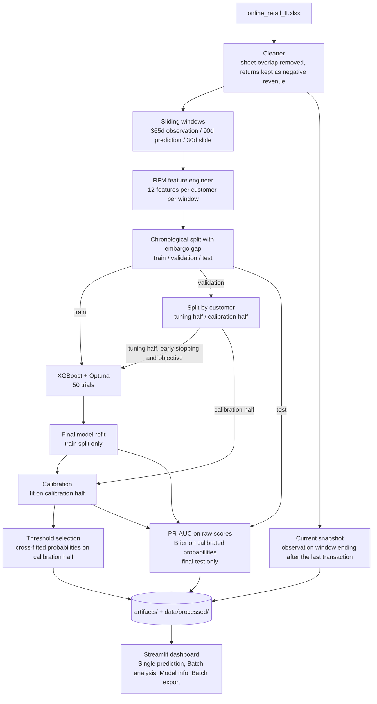

# Customer Churn Prediction with Profit Optimization

Predicts customer churn, calibrates the scores into probabilities, and decides per customer whether a retention offer is worth its cost (INTERVENE / DO NOT INTERVENE) using expected profit. A single global probability cutoff is computed only as a baseline.

Built on free, open tools: the public [Online Retail II](https://archive.ics.uci.edu/dataset/502/online+retail+ii) dataset, XGBoost, Optuna, scikit-learn, SHAP and Streamlit. No paid APIs, no GPU.

## Preview

<p align="center">
  
  <br>
  <sub>Single Prediction, manual feature entry: Main landing UI</sub>
</p>

> Additional screenshots in [`assets/`](assets/).

## What this is

Given the raw transaction file, the pipeline:

1. **Cleans it.** Drops rows without a customer ID and the December 2010 sheet overlap, keeps valid purchases, and keeps cancellations as negative revenue.
2. **Builds labeled examples.** Slides a 365-day observation window in 30-day steps. A customer is churned if they make no purchase in the next 90 days.
3. **Engineers 12 RFM-style features** per customer per window (see [Modeling choices](#modeling-choices)).
4. **Trains and calibrates.** Chronological split with an embargo gap, tuned XGBoost, calibration on separate data. The test period is used once.
5. **Decides by expected profit.** A customer is targeted only when the expected gain exceeds the offer cost. A global cutoff is computed as a baseline.
6. **Serves a Streamlit dashboard** for single customers and the whole current base, scored on a snapshot window with no outcome yet.

## Architecture


```mermaid
flowchart TD
    raw[online_retail_II.xlsx] --> clean[Cleaner\nsheet overlap removed, returns kept as negative revenue]
    clean --> windows[Sliding windows\n365d observation / 90d prediction / 30d slide]
    clean --> snapshot[Current snapshot\nobservation window ending after the last transaction]
    windows --> features[RFM feature engineer\n12 features per customer per window]
    features --> split[Chronological split with embargo gap\ntrain / validation / test]
    split -->|train| tune[XGBoost + Optuna\n50 trials]
    split -->|validation| vsplit[Split by customer\ntuning half / calibration half]
    vsplit -->|tuning half, early stopping and objective| tune
    tune --> finalfit[Final model refit\ntrain split only]
    vsplit -->|calibration half| calibrate[Calibration\nfit on calibration half]
    finalfit --> calibrate
    calibrate --> profit[Threshold selection\ncross-fitted probabilities on calibration half]
    finalfit --> metrics[PR-AUC on raw scores\nBrier on calibrated probabilities\nfinal test only]
    calibrate --> metrics
    split -->|test| metrics
    profit --> artifacts[(artifacts/ + data/processed/)]
    metrics --> artifacts
    snapshot --> artifacts
    artifacts --> dashboard[Streamlit dashboard\nSingle prediction, Batch analysis, Model info, Batch export]
```

`scripts/check_threshold_floor.py` is a reduced path through the same pipeline. It reloads the saved model, rebuilds the identical chronological and customer splits, recomputes cross-fitted calibrated probabilities on the calibration half, and re-sweeps thresholds. The split depends only on sorted window dates, `VALIDATION_SIZE`, `TEST_SIZE`, `EMBARGO_DAYS` and customer ID parity, and cross-fitting uses `RANDOM_SEED`, so the reproduction is exact. It first checks the recorded `embargo_days`, fit size and calibration row count against `split_metadata.pkl`.

## Results

| Metric | Value |
|---|---|
| PR-AUC (final temporal test, raw scores) | 0.7452 |
| Brier score (final temporal test, calibrated) | 0.2073 |
| Locked profit threshold (selected on validation, cross-fitted) | 0.01 |

Split sizes (embargo of 90 days at each boundary):

| Split | Rows | Share |
|---|---|---|
| Train | 17,009 | 39.5% |
| Validation | 4,336 (2,164 tuning, 2,172 calibration) | 10.1% |
| Test | 4,334 | 10.1% |
| Purged by embargo | 17,329 | 40.3% |

Profit comparison on the final test set:

| Strategy | Total Interventions | True Positives | Wasted Spend (FP) | Net Campaign Profit |
|---|---|---|---|---|
| Random (20%) | 866 | 429 | 437 | £4,433 |
| Default Threshold (0.5) | 3160 | 2001 | 1159 | £9,648 |
| Profit-Optimized Threshold | 4124 | 2204 | 1920 | £16,817 |
| Expected-Value Rule | 2751 | 1238 | 1513 | £23,618 |

Values come from the last `scripts/run_pipeline.py` run.

**Reading the results**

- PR-AUC uses raw scores because isotonic calibration creates ties; Brier uses calibrated probabilities. Judge PR-AUC against the churn base rate (`Churn rate` in the pipeline output) and Brier against a constant forecast, `p * (1 - p)`.
- "Profit-Optimized Threshold" is the best global cutoff on the calibration half; "Expected-Value Rule" is the dashboard's per-customer policy. The sweep starts at 0.00 (target everyone), so a locked threshold near 0, like 0.01 above, is effectively blanket targeting. No separate contact-everyone row is reported.
- Profit is simulated under the `config.py` assumptions, so the expected-value lead is partly by construction. One test window means no confidence interval.

## Expected Value Framework

```
E[Profit] = P(churn) * (intervention_success_rate * avg_monthly_spend * 3 months) - intervention_cost
```

`avg_monthly_spend` is net `monetary_total` (returns subtracted, floored at zero) over the window length in months (days / 30.44). `compute_avg_monthly_spend()` in `src/evaluation/profit_optimizer.py` defines it once for the sweep, evaluation and dashboard.

A customer is targeted only when expected profit is positive, so a high-risk, low-spend customer is correctly skipped. That is the core difference from thresholding on probability alone.

## Modeling choices

| Component | Details |
|---|---|
| Features (12) | `recency`, `frequency`, `monetary_total`, `monetary_avg`, `unique_products`, `spend_30d`, `spend_90d`, `interpurchase_mean`, `interpurchase_std`, `spend_trend`, `product_diversity`, `seasonal_dropoff` |
| Classifier | XGBoost, no class reweighting. Refit on the train split only, with `n_estimators` from the best trial's early-stopping iteration. |
| Tuning | Optuna TPE, 50 trials. Objective is PR-AUC on the tuning half, which also drives early stopping. Never sees the calibration half or test set. |
| Calibration | Isotonic (default) or Platt via `CALIBRATION_METHOD`, fit on the calibration half. Platt uses raw probabilities, not log-odds. Thresholds use `CALIBRATION_FOLDS`-fold cross-fitted probabilities. |
| Explainability | SHAP `TreeExplainer` waterfall per customer, on the uncalibrated log-odds. |

Optuna, XGBoost, cross-fitting and the random baseline all use `RANDOM_SEED`.

## Leakage controls

- **Asserted splits.** `temporal_train_val_test_split()` checks chronological order, disjoint partitions and a gap of at least `EMBARGO_DAYS` at each boundary.
- **Embargo.** Labels look 90 days ahead and windows slide 30, so the split purges `ceil(EMBARGO_DAYS / slide) - 1` windows per boundary (2 at the defaults, a 90-day gap). With too few windows it shrinks the embargo with a warning and skips the gap assertion.
- **Disjoint validation roles.** Customer ID parity splits validation into a tuning half (early stopping, Optuna) and a calibration half (calibration, thresholds). `tests/test_no_calibration_leakage.py` checks that every `fit()` uses only train rows.
- **Point-in-time cleaning.** Credits are dated at the credit note, so a later credit cannot change a window's features.

## Data Integrity

[Online Retail II](https://archive.ics.uci.edu/dataset/502/online+retail+ii) has 1,067,371 raw transactions from a UK online retailer (December 2009 to December 2011) across two sheets, `Year 2009-2010` and `Year 2010-2011`. The pipeline prints the cleaned count as `Cleaned transactions: <n>`.

- **Credit notes** have their own invoice number and cannot be matched to the original sale, so each stays a negative-revenue row at its own date. Returns never count as a purchase when labeling churn.
- **Sheet overlap.** Early December 2010 appears in both sheets. Second-sheet invoices already in the first are dropped.
- **Types.** Invoice and stock codes are normalized to strings because the raw file mixes integers and text.

## Dashboard

`app/app.py` reads artifacts only and never retrains.

- **Single prediction:** manual entry or snapshot lookup; churn probability, expected profit, decision, and a SHAP explanation of the raw score.
- **Batch analysis:** profit by strategy and the threshold sweep.
- **Model info:** features, architecture and profit formula.
- **Batch export:** scores the whole snapshot and downloads the intervention list and full results.

Manual entry derives product diversity, allows the drop-off flag only at 91 to 180 days recency, and requires 30-day <= 90-day <= total spend. Missing artifacts stop the app, a missing snapshot disables only lookup and export, a missing icon uses the default, a non-positive default-profit baseline switches lift to an absolute delta, and an xgboost version mismatch warns.

## Artifacts

`scripts/run_pipeline.py` writes:

- `artifacts/`: `xgb_model.pkl`, `calibrator.pkl`, `feature_names.pkl`, `calibration_method.pkl`, `optimal_threshold.pkl`, `metrics.pkl`, `split_metadata.pkl`
- `data/processed/`: `feature_matrix.pkl`, `current_snapshot.pkl`, `profit_comparison.csv`, `threshold_analysis.csv`

Pickles tie artifacts to the library versions that made them (`split_metadata.pkl` records the xgboost version), so re-run the pipeline after upgrading. Re-runs overwrite in place; copy both folders first to compare configurations. Both are git-ignored.

## Project Structure

```
profit-aware-churn-prediction/
├── data/
│   ├── raw/                             # place online_retail_II.xlsx here
│   └── processed/                       # generated feature matrix, snapshot, and results (gitignored)
├── artifacts/                           # serialized model, calibrator, threshold, and metadata (gitignored)
├── assets/                              # dashboard screenshots (landing_view.png) and optional icon (churn_ledger_icon.png)
│
├── src/
│   ├── data/
│   │   ├── cleaner.py                   # sheet overlap removal, returns as negative-revenue rows
│   │   └── temporal.py                  # sliding window generator and churn labels
│   ├── features/
│   │   └── rfm_engineer.py              # per-window feature computation and the current snapshot
│   ├── modeling/
│   │   ├── trainer.py                   # embargoed split, customer split of validation, early-stopped Optuna tuning
│   │   └── calibrator.py                # isotonic and Platt calibration, cross-fitted probabilities
│   └── evaluation/
│       ├── metrics.py                   # PR-AUC, Brier score
│       ├── profit_optimizer.py          # expected value, threshold sweep, baselines
│       └── explainability.py            # SHAP TreeExplainer wrapper used by the dashboard
│
├── scripts/
│   ├── run_pipeline.py                  # end-to-end cleaning, training, calibration, evaluation, artifact export
│   └── check_threshold_floor.py         # reproduces the threshold sweep from saved artifacts without retraining
│
├── app/app.py                           # Streamlit dashboard (reads artifacts/ and data/processed/)
├── .streamlit/config.toml               # dashboard light theme, independent of OS or browser dark mode
│
├── tests/
│   ├── test_temporal.py                 # window boundaries, churn labels, return handling
│   ├── test_rfm_engineer.py             # feature math, returns, invoice-level intervals, trend, snapshot
│   ├── test_profit_optimizer.py         # threshold sweep, argmax, spend scaling, seeded baseline, expected-value rule
│   ├── test_temporal_split.py           # chronological order, split integrity, embargo gap and purge count, customer split of validation
│   ├── test_cleaner.py                  # returns as negative rows, sheet overlap, price and quantity filters
│   ├── test_calibrator.py               # calibration functions, cross-fitting, metric inputs
│   └── test_no_calibration_leakage.py   # every fit uses train rows only, validation halves are disjoint
│
├── config.py                            # all constants, paths, financial parameters
├── requirements.txt
├── .gitignore
└── README.md
```

## Getting started

1. **Get the dataset.** Download [Online Retail II](https://archive.ics.uci.edu/dataset/502/online+retail+ii), unzip if needed, and place the workbook at `data/raw/online_retail_II.xlsx`. It must contain both sheets named under [Data Integrity](#data-integrity).

2. **Install.**
   ```bash
   git clone https://github.com/abhinavharbola/profit-aware-churn-prediction
   cd profit-aware-churn-prediction
   python -m venv venv
   source venv/bin/activate
   pip install -r requirements.txt
   ```
   On Windows, activate with `venv\Scripts\activate` instead.

3. **Configure (optional).** A first run needs no changes. Tunable in `config.py`: windowing (`OBSERVATION_WINDOW_DAYS`, `PREDICTION_WINDOW_DAYS`, `SLIDE_INTERVAL_DAYS`), economics (`COST_OF_OFFER`, `INTERVENTION_SUCCESS_RATE`, `MONTHS_REVENUE_SAVED`), splits (`VALIDATION_SIZE`, `TEST_SIZE`, `EMBARGO_DAYS`), modeling (`RANDOM_SEED`, `OPTUNA_TRIALS`, `EARLY_STOPPING_ROUNDS`, `CALIBRATION_METHOD`, `CALIBRATION_FOLDS`) and baselines (`DEFAULT_THRESHOLD`, `RANDOM_TARGET_FRACTION`). Keep `EMBARGO_DAYS` at or above `PREDICTION_WINDOW_DAYS`.

## Running it

```bash
python scripts/run_pipeline.py
pytest tests/ -v
streamlit run app/app.py
python scripts/check_threshold_floor.py
```

- `run_pipeline.py` cleans, tunes, calibrates, evaluates and saves artifacts.
- `pytest` runs 70 offline tests on synthetic fixtures (no dataset). They check code and leakage controls, not model quality.
- `streamlit` needs the pipeline artifacts.
- `check_threshold_floor.py` (optional) reproduces the locked threshold and prints a finer-grid diagnostic. It is a reproducibility check, not a leakage check.

## Known limitations

- **Few windows.** About 10 windows exist; with the 90-day embargo that leaves roughly 4 train, 1 validation and 1 test. A smaller `EMBARGO_DAYS` keeps more data but allows partial label overlap. Threshold and profit figures each rest on one period.
- **Repeated customers.** Customers recur across splits and observation windows overlap. Test labels never enter training, so this is not label leakage, but metrics are likely optimistic versus a customer-disjoint test.
- **Simulated profit.** The success rate is a constant; production should replace it with A/B results. `avg_monthly_spend` undervalues customers who started mid-window.
- **Features.** `monetary_avg` is per line item, not per order. `seasonal_dropoff` is a two-period recency flag, not a calendar signal.
- **Snapshot.** No outcome yet, and its transactions overlap training and test windows; only its rows are new.
- **Manual entry.** The spend ordering rule can reject real profiles with returns.