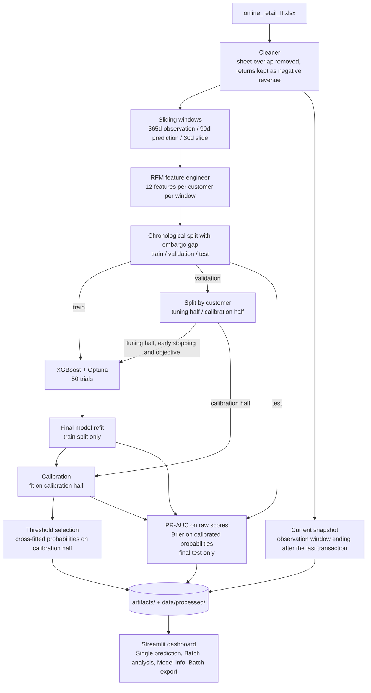

# Customer Churn Prediction with Profit Optimization

Given a customer transaction history, this pipeline predicts churn probability, calibrates it into a usable probability, and turns that into a per-customer INTERVENE / DO NOT INTERVENE decision based on whether the expected financial gain of a retention offer exceeds its cost. A single global probability cutoff is computed only as a baseline to compare against.

Built entirely on free, open infrastructure: the public [Online Retail II](https://archive.ics.uci.edu/dataset/502/online+retail+ii) dataset, open-source libraries (XGBoost, Optuna, scikit-learn, SHAP, Streamlit), no paid APIs, no GPU required.

## What this is

Given the raw transaction file, the pipeline:

1. **Cleans it.** Rows without a customer ID are dropped. Invoices in the second sheet that already appear in the first are dropped, because the two sheets overlap in December 2010. Only positive prices are kept, purchases must have positive quantity, and each cancellation (invoice starting with `C`) is kept as a negative-revenue row at the date of the credit note.
2. **Builds sliding windows.** Each window has a 365-day observation period followed by a 90-day prediction period, advancing 30 days at a time, so a customer contributes several labeled examples across different points in time rather than one static snapshot.
3. **Engineers 12 features per customer per window:** recency, frequency, total and average revenue, unique products, 30-day and 90-day spend, mean and standard deviation of days between invoices, a spend trend slope, product diversity, and a recent drop-off flag. Churn is labeled 1 when the customer makes no purchase in the following 90 days. Returns never count as a purchase.
4. **Splits chronologically with an embargo gap** around each split boundary. The validation period is divided by customer into a tuning half (early stopping and the Optuna objective) and a calibration half (calibration and threshold selection), so no validation row plays two roles. Final metrics are computed once on a later test period.
5. **Sweeps decision thresholds** on cross-fitted calibrated probabilities to find the single global cutoff that maximizes net campaign profit. This is a baseline. The decision rule the dashboard applies is per-customer expected profit.
6. **Serves everything through a four-tab Streamlit dashboard:** Single prediction, Batch analysis, Model info, and Batch export. Customer lookup and batch scoring use a current snapshot whose observation window ends after the last transaction in the data, so they score customers on data the model was never trained or tested on.

## Architecture


```mermaid
flowchart TD
    raw[online_retail_II.xlsx] --> clean[Cleaner\nsheet overlap removed, returns kept as negative revenue]
    clean --> windows[Sliding windows\n365d observation / 90d prediction / 30d slide]
    clean --> snapshot[Current snapshot\nobservation window ending after the last transaction]
    windows --> features[RFM feature engineer\n12 features per customer per window]
    features --> split[Chronological split with embargo gap\ntrain / validation / test]
    split -->|train| tune[XGBoost + Optuna\n50 trials]
    split -->|validation| vsplit[Split by customer\ntuning half / calibration half]
    vsplit -->|tuning half, early stopping and objective| tune
    tune --> finalfit[Final model refit\ntrain split only]
    vsplit -->|calibration half| calibrate[Calibration\nfit on calibration half]
    finalfit --> calibrate
    calibrate --> profit[Threshold selection\ncross-fitted probabilities on calibration half]
    finalfit --> metrics[PR-AUC on raw scores\nBrier on calibrated probabilities\nfinal test only]
    calibrate --> metrics
    split -->|test| metrics
    profit --> artifacts[(artifacts/ + data/processed/)]
    metrics --> artifacts
    snapshot --> artifacts
    artifacts --> dashboard[Streamlit dashboard\nSingle prediction, Batch analysis, Model info, Batch export]
```

`scripts/check_threshold_floor.py` runs a reduced path through this architecture. It reloads the saved model, reproduces the identical chronological split and the customer split of the validation period, recomputes cross-fitted calibrated probabilities on the calibration half, and re-sweeps thresholds, skipping cleaning, windowing, feature engineering, and tuning. The split is a pure function of the sorted window dates, `VALIDATION_SIZE`, `TEST_SIZE`, `EMBARGO_DAYS`, and customer ID parity, and the cross-fitting is seeded by `RANDOM_SEED`, so the reproduction is exact. Before trusting it, the script checks the recorded `embargo_days`, fit size, and calibration row count against the saved `split_metadata.pkl`.

## Results

<!-- RESULTS:START -->
Results have not been generated for this snapshot. Run `python scripts/run_pipeline.py`, then `python scripts/update_readme_results.py`, to write the metrics, split sizes, and profit comparison here.
<!-- RESULTS:END -->

**Reading the results**

- Churn is not a rare event in this dataset, so PR-AUC must be read against the churn base rate printed by the pipeline as `Churn rate`, not against a rare-event rate. A constant forecast equal to the base rate `p` scores a Brier of `p * (1 - p)`, and the calibrated Brier score is informative only to the extent it beats that.
- PR-AUC is computed on raw model scores. Isotonic calibration maps many scores to the same value, and the resulting ties distort a ranking metric. Brier score is computed on calibrated probabilities, since it measures probability quality.
- "Profit-Optimized Threshold" is the best single global cutoff found on the calibration half of the validation period. "Expected-Value Rule" is the per-customer policy the dashboard applies. Both are evaluated on the same untouched test period, alongside a random baseline and the default 0.5 cutoff.
- There is no contact-everyone baseline, so the model's gain over blanket targeting is not measured here.
- The test period is a small number of windows, so profit figures are a single-period estimate with no confidence interval.

## Expected Value Framework

```
E[Profit] = P(churn) * (intervention_success_rate * avg_monthly_spend * 3 months) - intervention_cost
```

`avg_monthly_spend` is a customer's `monetary_total` (net revenue across the observation window, returns subtracted, floored at zero) divided by the window length in months (days / 30.44). It is computed once by `compute_avg_monthly_spend()` in `src/evaluation/profit_optimizer.py` and used identically in training evaluation, the threshold sweep, and the dashboard. The divisor is the full window regardless of tenure, so a customer who started mid-window is valued conservatively.

A customer is targeted only when expected profit is positive. A customer with a high churn probability but low monthly spend can correctly be flagged DO NOT INTERVENE, because the expected return does not clear the intervention cost. This is the core difference from thresholding on probability alone.

## Models

| Role | Model | Library | Notes |
|---|---|---|---|
| Churn classifier | XGBoost (`XGBClassifier`) | `xgboost` | No class reweighting: no SMOTE, no `scale_pos_weight`. Post-hoc calibration corrects score distortion instead. The final model is refit on the train split only, with `n_estimators` set from the best trial's early-stopping iteration. |
| Hyperparameter search | TPE sampler (Optuna default) | `optuna` | 50 trials. The objective is PR-AUC on the tuning half of the validation period, with `early_stopping_rounds` and `eval_metric="aucpr"` wired to that same half. Never sees the calibration half or the test set. |
| Calibration | Isotonic regression | `scikit-learn` | Default. Platt scaling (`LogisticRegression`) is available through `CALIBRATION_METHOD`. Fit on the calibration half of the validation period. Threshold selection uses `CALIBRATION_FOLDS`-fold cross-fitted probabilities, so the threshold is not chosen on in-sample calibrated values. |
| Explainability | SHAP `TreeExplainer` | `shap` | Per-customer waterfall plot in the dashboard only. It explains the uncalibrated model log-odds, not the calibrated probability, and the dashboard says so. |

Every modeling decision is made before the final test period: hyperparameters, calibration, and the threshold use disjoint halves of the validation period, and the test period is touched only after those choices are locked.

## Guardrails

- **Split integrity is asserted.** `temporal_train_val_test_split()` in `src/modeling/trainer.py` checks chronological order, disjoint partitions, and that the day gap across each boundary is at least `EMBARGO_DAYS`. Covered by `tests/test_temporal_split.py`.
- **Embargoed boundaries.** Labels look 90 days ahead but windows slide every 30, so neighboring windows across a boundary would share label-defining transactions. The split keeps boundary windows `ceil(EMBARGO_DAYS / slide)` steps apart, purging `ceil(EMBARGO_DAYS / slide) - 1` windows at each boundary (2 at the defaults) for a gap of at least `EMBARGO_DAYS` (exactly 90 days at the defaults, since 90 is a multiple of the 30-day slide). If too few windows exist, the embargo is reduced with a warning and the gap assertion is skipped. The purged row count is stored in `split_metadata.pkl`.
- **Validation roles are disjoint.** The validation period is split by customer ID parity. Early stopping and the Optuna objective see only the tuning half, and calibration and threshold selection see only the calibration half. `tests/test_no_calibration_leakage.py` inspects every `XGBClassifier.fit()` call to confirm each fit uses only train rows and the final refit has no eval set. `split_metadata.pkl` records the actual final fit size, which `check_threshold_floor.py` compares with the reproduced train split.
- **Point-in-time cleaning.** Cancellations are negative-revenue rows dated at the credit note, so a credit issued after a window ends cannot change that window's features, and returns never count as a purchase when labeling churn.
- **One seed source.** Optuna, XGBoost, cross-fitting, and the random baseline all read `RANDOM_SEED` from `config.py`. The baseline uses a local `RandomState` and does not touch global numpy state.
- **Consistent inputs in the dashboard.** Manual entry derives product diversity from unique products and frequency, allows the drop-off flag only when recency exceeds 90 days, and rejects spend values that violate 30-day spend <= 90-day spend <= monetary total.
- **Fails soft.** Missing artifacts stop the app with a "run the pipeline first" message. A missing snapshot disables only customer lookup and batch export. A missing icon falls back to the default page icon. Profit lift falls back to an absolute delta when the default baseline is zero or negative. A mismatch between the saved and installed xgboost version raises a warning.

## Artifacts

`scripts/run_pipeline.py` writes everything the dashboard needs to two places.

- `artifacts/`: `xgb_model.pkl`, `calibrator.pkl`, `feature_names.pkl`, `calibration_method.pkl`, `optimal_threshold.pkl`, `metrics.pkl`, `split_metadata.pkl`
- `data/processed/`: `feature_matrix.pkl`, `current_snapshot.pkl`, `profit_comparison.csv`, `threshold_analysis.csv`

`app/app.py` only reads these and never retrains. Profit values in `profit_comparison.csv` are stored as numbers and formatted only for display.

Models are pickled, so artifacts are tied to the library versions that produced them. `split_metadata.pkl` records the xgboost version and the dashboard warns on a mismatch. Re-run the pipeline after upgrading.

Re-running the pipeline overwrites all of the above in place, with no versioning or run history. To compare two configurations, copy `data/processed/` and `artifacts/` before re-running with different `config.py` values. Both directories are git-ignored.

## Data Integrity

In Online Retail II, a credit note carries its own invoice number and does not reuse the number of the invoice it reverses, so returns cannot be matched to the original purchase from the invoice number alone. The cleaner therefore does not try, and its behavior does not depend on whether the numbers line up in your copy of the file. Each credit note is kept as a negative-revenue row at its own date. Returns reduce revenue in the window where they occur, which is point-in-time correct, at the cost of not attributing a return to the window of the original sale.

The two sheets of the source file overlap in early December 2010. Invoices from the second sheet that already appear in the first are dropped, so revenue in that period is not counted twice. If your copy has no overlap, this step removes nothing.

Invoice and stock code columns are normalized to strings, since the raw file mixes integer and text values.

## Dataset

[Online Retail II (UCI)](https://archive.ics.uci.edu/dataset/502/online+retail+ii): 1,067,371 raw transactional records from a UK-based online retailer, spanning December 2009 to December 2011, across two sheets (`Year 2009-2010`, `Year 2010-2011`) of one `.xlsx` file. `src/data/cleaner.py` loads both and removes the overlap (`load_raw_data`, `combine_sheets`).

The post-cleaning row count depends on the file in `data/raw/`, so it is not hardcoded here. `scripts/run_pipeline.py` prints it as `Cleaned transactions: <n>`.

## Project Structure

```
profit-aware-churn-prediction/
|
|-- .streamlit/config.toml          explicit theme, independent of OS or browser dark mode
|-- config.py                       all constants, paths, financial parameters
|-- requirements.txt
|-- .gitignore
|-- README.md
|
|-- scripts/
|   |-- run_pipeline.py             end-to-end cleaning, training, calibration, evaluation, artifact export
|   |-- check_threshold_floor.py    reproduces the threshold sweep from saved artifacts without retraining
|   |-- update_readme_results.py    writes latest metrics and profit comparison into the README results block
|
|-- src/
|   |-- data/
|   |   |-- cleaner.py              sheet overlap removal, returns as negative-revenue rows
|   |   |-- temporal.py             sliding window generator and churn labels
|   |-- features/
|   |   |-- rfm_engineer.py         per-window feature computation and the current snapshot
|   |-- modeling/
|   |   |-- trainer.py              embargoed split, customer split of validation, early-stopped Optuna tuning
|   |   |-- calibrator.py           isotonic and Platt calibration, cross-fitted probabilities
|   |-- evaluation/
|       |-- metrics.py              PR-AUC, Brier score
|       |-- profit_optimizer.py     expected value, threshold sweep, baselines
|       |-- explainability.py       SHAP TreeExplainer wrapper used by the dashboard
|
|-- app/app.py                      Streamlit dashboard
|
|-- tests/
|   |-- test_temporal.py                  window boundaries, churn labels, return handling
|   |-- test_rfm_engineer.py              feature math, returns, invoice-level intervals, trend, snapshot
|   |-- test_profit_optimizer.py          threshold sweep, argmax, spend scaling, seeded baseline, expected-value rule
|   |-- test_temporal_split.py            chronological order, split integrity, embargo gap and purge count, customer split of validation
|   |-- test_cleaner.py                   returns as negative rows, sheet overlap, price and quantity filters
|   |-- test_calibrator.py                calibration functions, cross-fitting, metric inputs
|   |-- test_no_calibration_leakage.py    every fit uses train rows only, validation halves are disjoint
|
|-- data/
|   |-- raw/                        place online_retail_II.xlsx here
|   |-- processed/                  generated feature matrix, snapshot, and results
|
|-- artifacts/                      serialized model, calibrator, threshold, and metadata
|-- assets/                         optional dashboard icon (churn_ledger_icon.png)
```

## Getting started

1. **Get the dataset.** Download Online Retail II from the [UCI repository](https://archive.ics.uci.edu/dataset/502/online+retail+ii). If it arrives as a zip, extract it. Place the workbook in `data/raw/` named exactly `online_retail_II.xlsx`. The pipeline reads the sheets `Year 2009-2010` and `Year 2010-2011`, so the workbook must contain both.

2. **Install.**
   ```bash
   git clone <repo-url>
   cd profit-aware-churn-prediction
   python -m venv venv
   source venv/bin/activate
   pip install -r requirements.txt
   ```
   On Windows, activate with `venv\Scripts\activate` instead.

3. **Review `config.py` (optional).** A first run needs no changes, but every financial and windowing assumption lives there.

   | Parameter | Default | Description |
   |---|---|---|
   | `OBSERVATION_WINDOW_DAYS` | 365 | Length of the observation window |
   | `PREDICTION_WINDOW_DAYS` | 90 | Churn lookahead period |
   | `SLIDE_INTERVAL_DAYS` | 30 | Step size for sliding windows |
   | `COST_OF_OFFER` | 10.0 | Cost per retention intervention (£) |
   | `INTERVENTION_SUCCESS_RATE` | 0.15 | Fraction of churners who accept the offer |
   | `MONTHS_REVENUE_SAVED` | 3 | Revenue horizon if the customer is retained |
   | `RANDOM_SEED` | 42 | Seed for Optuna, XGBoost, cross-fitting, and the random baseline |
   | `OPTUNA_TRIALS` | 50 | Number of hyperparameter search trials |
   | `EARLY_STOPPING_ROUNDS` | 30 | Early stopping patience for each trial |
   | `CALIBRATION_METHOD` | isotonic | `isotonic` or `platt` |
   | `CALIBRATION_FOLDS` | 5 | Folds used to cross-fit probabilities for threshold selection |
   | `DEFAULT_THRESHOLD` | 0.5 | Cutoff for the default-threshold baseline |
   | `RANDOM_TARGET_FRACTION` | 0.2 | Share of customers targeted by the random baseline |
   | `VALIDATION_SIZE` | 0.2 | Fraction of windows used for the validation period |
   | `TEST_SIZE` | 0.2 | Fraction of windows used for the final test period |
   | `EMBARGO_DAYS` | 90 | Minimum day gap at each split boundary. Equal to `PREDICTION_WINDOW_DAYS` removes label overlap across boundaries |

## Running it

```bash
python scripts/run_pipeline.py
python scripts/update_readme_results.py
pytest tests/ -v
streamlit run app/app.py
```

- `run_pipeline.py` cleans, tunes, calibrates, selects the threshold, evaluates, and saves artifacts.
- `update_readme_results.py` writes the latest metrics and profit comparison into the results block above.
- `pytest tests/ -v` runs 69 tests offline on small synthetic fixtures. No dataset is needed.
- `streamlit run app/app.py` starts the dashboard and needs the artifacts from the pipeline run.

The dashboard has four tabs.

- **Single prediction** takes manual feature entry or a customer ID lookup from the current snapshot. It returns churn probability, expected profit, the INTERVENE / DO NOT INTERVENE decision, and revenue at stake, with a financial breakdown and a SHAP explanation of the raw model score.
- **Batch analysis** compares net profit across the random, default-threshold, profit-optimized-threshold, and expected-value strategies, and charts the full threshold sweep.
- **Model info** documents the architecture, every feature, and the profit formula in one place.
- **Batch export** scores every customer in the current snapshot and offers a downloadable intervention list, each row carrying its own expected profit, plus the full scored set.

## Evaluation

- **Unit tests** (`pytest tests/ -v`, 69 tests) check code correctness, not model quality: window boundaries, feature math, the profit formula, return handling, split disjointness and embargo, calibration and cross-fitting, and that no model fit touches validation or test rows. The file-level breakdown is in [Project Structure](#project-structure).
- **Model quality** is PR-AUC (raw scores), Brier score (calibrated probabilities), and net campaign profit, computed once on the held-out test period by `scripts/run_pipeline.py`. PR-AUC summarizes precision and recall across all cutoffs and is read against the churn base rate.
- **Threshold recheck.** `scripts/check_threshold_floor.py` re-sweeps thresholds on the calibration half and confirms the recorded fit size equals the reproduced train split. It shows the sweep is reproducible, not that its inputs are leak-free. That is the job of the leakage test.

## Known limitations

- **Embargo cost.** The two-year date range yields about 10 windows at the default settings. A 90-day embargo purges 2 windows at each boundary, leaving roughly 4 train, 1 validation, and 1 test window. Lowering `EMBARGO_DAYS` (for example to 30) keeps more data but allows partial label overlap across boundaries.
- **Residual feature overlap.** The embargo removes label overlap only. 365-day observation windows on opposite sides of a boundary still share most of their transactions. Removing that would need an embargo of at least `OBSERVATION_WINDOW_DAYS + PREDICTION_WINDOW_DAYS`, which this dataset cannot support.
- **Single validation window.** The tuning and calibration halves are separated by customer, not by time, so they share the same market period. Threshold selection is cross-fitted but still rests on one period of data.
- **Not customer-disjoint.** The same customer appears in several windows and across splits. The test period is strictly later than train and validation.
- **Returns are dated at the credit note**, not linked to the original sale.
- **`avg_monthly_spend` divides by the full window**, so customers who started mid-window are undervalued.
- **`monetary_avg` is revenue per purchase line item**, not per order.
- **`seasonal_dropoff` is a two-period recency flag** (active 91 to 180 days ago, inactive in the last 90), not a calendar-seasonal signal.
- **The intervention success rate is a constant** in `config.py`, not learned. In production it should come from A/B tests.
- **Snapshot scores have no outcome yet.** Customers are scored on the window ending after the last transaction, whose 90-day label period has not happened.
- **Cold-start customers** with no purchase in the last observation window cannot be scored.
- **The locked global threshold** is used only for the baseline comparison. Per-customer decisions use expected value.
