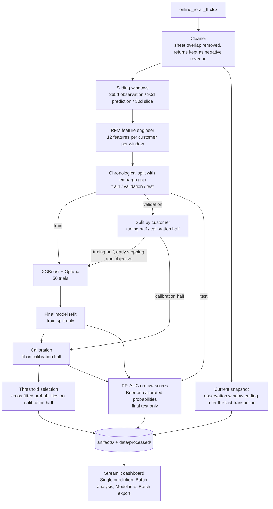

# Customer Churn Prediction with Profit Optimization

Predicts customer churn, calibrates the scores into probabilities, and decides per customer whether a retention offer is worth its cost (INTERVENE / DO NOT INTERVENE) using expected profit. A single global probability cutoff is computed only as a baseline.

Built on free, open tools: the public [Online Retail II](https://archive.ics.uci.edu/dataset/502/online+retail+ii) dataset, XGBoost, Optuna, scikit-learn, SHAP and Streamlit. No paid APIs, no GPU.

## Preview

<p align="center">
  
  <br>
  <sub>Single Prediction, manual feature entry: Main landing UI</sub>
</p>

> Additional screenshots in [`assets/`](assets/).

## What this is

Given the raw transaction file, the pipeline:

1. **Cleans it.** Drops rows without a customer ID, drops second-sheet invoices already present in the first (the sheets overlap in December 2010), keeps positive prices and positive-quantity purchases, and keeps each cancellation (invoice starting `C`) as a negative-revenue row at the credit note date.
2. **Slides windows.** 365-day observation, 90-day prediction, 30-day step, so each customer contributes several labeled examples over time.
3. **Computes 12 features per customer per window:** recency, frequency, total and average revenue, unique products, 30-day and 90-day spend, mean and standard deviation of days between invoices, spend trend slope, product diversity, and a recent drop-off flag. Churn is 1 when the customer makes no purchase in the next 90 days. Returns never count as a purchase.
4. **Splits chronologically with an embargo gap** at each boundary. Validation is divided by customer into a tuning half (early stopping, Optuna objective) and a calibration half (calibration, threshold selection), so no validation row serves two roles. The test period is used once, at the end.
5. **Sweeps thresholds** on cross-fitted calibrated probabilities for the global cutoff that maximizes net profit. This is a baseline. The dashboard decides per customer by expected profit.
6. **Serves a four-tab Streamlit dashboard** (Single prediction, Batch analysis, Model info, Batch export). Lookup and batch scoring use a current snapshot whose observation window ends after the last transaction, so customers are scored on data the model never trained or tested on.

## Architecture


```mermaid
flowchart TD
    raw[online_retail_II.xlsx] --> clean[Cleaner\nsheet overlap removed, returns kept as negative revenue]
    clean --> windows[Sliding windows\n365d observation / 90d prediction / 30d slide]
    clean --> snapshot[Current snapshot\nobservation window ending after the last transaction]
    windows --> features[RFM feature engineer\n12 features per customer per window]
    features --> split[Chronological split with embargo gap\ntrain / validation / test]
    split -->|train| tune[XGBoost + Optuna\n50 trials]
    split -->|validation| vsplit[Split by customer\ntuning half / calibration half]
    vsplit -->|tuning half, early stopping and objective| tune
    tune --> finalfit[Final model refit\ntrain split only]
    vsplit -->|calibration half| calibrate[Calibration\nfit on calibration half]
    finalfit --> calibrate
    calibrate --> profit[Threshold selection\ncross-fitted probabilities on calibration half]
    finalfit --> metrics[PR-AUC on raw scores\nBrier on calibrated probabilities\nfinal test only]
    calibrate --> metrics
    split -->|test| metrics
    profit --> artifacts[(artifacts/ + data/processed/)]
    metrics --> artifacts
    snapshot --> artifacts
    artifacts --> dashboard[Streamlit dashboard\nSingle prediction, Batch analysis, Model info, Batch export]
```

`scripts/check_threshold_floor.py` is a reduced path through the same pipeline. It reloads the saved model, rebuilds the identical chronological and customer splits, recomputes cross-fitted calibrated probabilities on the calibration half, and re-sweeps thresholds. The split depends only on sorted window dates, `VALIDATION_SIZE`, `TEST_SIZE`, `EMBARGO_DAYS` and customer ID parity, and cross-fitting uses `RANDOM_SEED`, so the reproduction is exact. It first checks the recorded `embargo_days`, fit size and calibration row count against `split_metadata.pkl`.

## Results

<!-- RESULTS:START -->
| Metric | Value |
|---|---|
| PR-AUC (final temporal test, raw scores) | 0.7452 |
| Brier score (final temporal test, calibrated) | 0.2073 |
| Locked profit threshold (selected on validation, cross-fitted) | 0.01 |

Split sizes (embargo of 90 days at each boundary):

| Split | Rows | Share |
|---|---|---|
| Train | 17,009 | 39.5% |
| Validation | 4,336 (2,164 tuning, 2,172 calibration) | 10.1% |
| Test | 4,334 | 10.1% |
| Purged by embargo | 17,329 | 40.3% |

Profit comparison on the final test set:

| Strategy | Total Interventions | True Positives | Wasted Spend (FP) | Net Campaign Profit |
|---|---|---|---|---|
| Random (20%) | 866 | 429 | 437 | £4,433 |
| Default Threshold (0.5) | 3160 | 2001 | 1159 | £9,648 |
| Profit-Optimized Threshold | 4124 | 2204 | 1920 | £16,817 |
| Expected-Value Rule | 2751 | 1238 | 1513 | £23,618 |

Generated by `scripts/update_readme_results.py` from the artifacts of the last `scripts/run_pipeline.py` run. Re-run both after changing the data, seed, windowing, or financial assumptions.
<!-- RESULTS:END -->

**Reading the results**

- Churn is not a rare event here, so read PR-AUC against the churn base rate the pipeline prints as `Churn rate`. A constant forecast at base rate `p` scores a Brier of `p * (1 - p)`; the calibrated Brier is informative only to the extent it beats that.
- PR-AUC uses raw scores because isotonic calibration creates ties that distort a ranking metric. Brier uses calibrated probabilities because it measures probability quality.
- "Profit-Optimized Threshold" is the best global cutoff on the calibration half. "Expected-Value Rule" is the per-customer policy the dashboard applies. Both run on the same untouched test period, alongside a random baseline and the 0.5 cutoff.
- There is no contact-everyone baseline, so the gain over blanket targeting is not measured.
- The test period is a single window at the defaults, so profit figures are a single-period estimate with no confidence interval.

## Expected Value Framework

```
E[Profit] = P(churn) * (intervention_success_rate * avg_monthly_spend * 3 months) - intervention_cost
```

`avg_monthly_spend` is `monetary_total` (net revenue over the observation window, returns subtracted, floored at zero) divided by the window length in months (days / 30.44). `compute_avg_monthly_spend()` in `src/evaluation/profit_optimizer.py` is the single definition, used by the threshold sweep, the evaluation and the dashboard. Dividing by the full window regardless of tenure undervalues customers who started mid-window.

A customer is targeted only when expected profit is positive. A high-churn-probability, low-spend customer is correctly flagged DO NOT INTERVENE when the expected return does not clear the cost. That is the core difference from thresholding on probability alone.

## Models

| Role | Model | Library | Notes |
|---|---|---|---|
| Churn classifier | XGBoost (`XGBClassifier`) | `xgboost` | No class reweighting (no SMOTE, no `scale_pos_weight`); calibration corrects score distortion. The final model is refit on the train split only, with `n_estimators` from the best trial's early-stopping iteration. |
| Hyperparameter search | TPE sampler (Optuna default) | `optuna` | 50 trials. Objective is PR-AUC on the tuning half, with `early_stopping_rounds` and `eval_metric="aucpr"` on that same half. Never sees the calibration half or the test set. |
| Calibration | Isotonic regression | `scikit-learn` | Isotonic by default, Platt (`LogisticRegression`) via `CALIBRATION_METHOD`. Fit on the calibration half. Threshold selection uses `CALIBRATION_FOLDS`-fold cross-fitted probabilities, so it is not chosen on in-sample calibrated values. |
| Explainability | SHAP `TreeExplainer` | `shap` | Per-customer waterfall in the dashboard only. Explains the uncalibrated log-odds, not the calibrated probability, and the dashboard says so. |

All modeling decisions precede the test period: hyperparameters, calibration and threshold use disjoint halves of validation, and the test period is touched only after they are locked.

## Guardrails

- **Split integrity is asserted.** `temporal_train_val_test_split()` (`src/modeling/trainer.py`) checks chronological order, disjoint partitions, and a gap of at least `EMBARGO_DAYS` across each boundary. Tested in `tests/test_temporal_split.py`.
- **Embargoed boundaries.** Labels look 90 days ahead but windows slide 30, so neighboring windows across a boundary share label-defining transactions. Boundary windows are kept `ceil(EMBARGO_DAYS / slide)` steps apart, purging `ceil(EMBARGO_DAYS / slide) - 1` windows per boundary: 2 at the defaults, for a gap of at least `EMBARGO_DAYS` (exactly 90 days at the defaults). With too few windows the embargo is reduced with a warning and the gap assertion is skipped. Purged rows are recorded in `split_metadata.pkl`.
- **Validation roles are disjoint.** Validation is split by customer ID parity. Early stopping and the Optuna objective see only the tuning half; calibration and threshold selection see only the calibration half. `tests/test_no_calibration_leakage.py` inspects every `XGBClassifier.fit()` call to confirm each fit uses only train rows and the final refit has no eval set. `split_metadata.pkl` records the final fit size, which `check_threshold_floor.py` compares with the reproduced train split.
- **Point-in-time cleaning.** Cancellations are negative-revenue rows dated at the credit note, so a later credit cannot change a window's features, and returns never count as a purchase when labeling churn.
- **One seed source.** Optuna, XGBoost, cross-fitting and the random baseline read `RANDOM_SEED`. The baseline uses a local `RandomState`, not global numpy state.
- **Consistent dashboard inputs.** Manual entry derives product diversity from unique products and frequency, allows the drop-off flag only when recency exceeds 90 days, and rejects spend values that break 30-day <= 90-day <= monetary total.
- **Fails soft.** Missing artifacts stop the app with a "run the pipeline first" message. A missing snapshot disables only customer lookup and batch export. A missing icon falls back to the default. Profit lift falls back to an absolute delta when the default baseline is zero or negative. An xgboost version mismatch between saved artifacts and the installed version raises a warning.

## Artifacts

`scripts/run_pipeline.py` writes:

- `artifacts/`: `xgb_model.pkl`, `calibrator.pkl`, `feature_names.pkl`, `calibration_method.pkl`, `optimal_threshold.pkl`, `metrics.pkl`, `split_metadata.pkl`
- `data/processed/`: `feature_matrix.pkl`, `current_snapshot.pkl`, `profit_comparison.csv`, `threshold_analysis.csv`

`app/app.py` only reads these and never retrains. Profit values in `profit_comparison.csv` are numeric and formatted only for display.

Models are pickled, so artifacts are tied to the library versions that made them. `split_metadata.pkl` records the xgboost version and the dashboard warns on a mismatch. Re-run the pipeline after upgrading.

Re-running overwrites everything in place, with no versioning. To compare configurations, copy `data/processed/` and `artifacts/` first. Both are git-ignored.

## Data Integrity

In Online Retail II a credit note has its own invoice number rather than reusing the one it reverses, so returns cannot be matched to the original purchase by number. The cleaner does not try, and works the same whether or not numbers line up in your copy. Each credit note stays a negative-revenue row at its own date: returns reduce revenue in the window where they occur (point-in-time correct) but are not attributed to the window of the original sale.

The two sheets overlap in early December 2010. Second-sheet invoices already in the first are dropped so that period is not counted twice. If your copy has no overlap, this removes nothing.

Invoice and stock code columns are normalized to strings because the raw file mixes integer and text values.

## Dataset

[Online Retail II (UCI)](https://archive.ics.uci.edu/dataset/502/online+retail+ii): 1,067,371 raw transactions from a UK online retailer, December 2009 to December 2011, across two sheets (`Year 2009-2010`, `Year 2010-2011`) of one `.xlsx`. `src/data/cleaner.py` loads both and removes the overlap (`load_raw_data`, `combine_sheets`).

The post-cleaning row count depends on your file. `scripts/run_pipeline.py` prints it as `Cleaned transactions: <n>`.

## Project Structure

```
profit-aware-churn-prediction/
|
|-- .streamlit/config.toml          explicit theme, independent of OS or browser dark mode
|-- config.py                       all constants, paths, financial parameters
|-- requirements.txt
|-- .gitignore
|-- README.md
|
|-- scripts/
|   |-- run_pipeline.py             end-to-end cleaning, training, calibration, evaluation, artifact export
|   |-- check_threshold_floor.py    reproduces the threshold sweep from saved artifacts without retraining
|   |-- update_readme_results.py    writes latest metrics and profit comparison into the README results block
|
|-- src/
|   |-- data/
|   |   |-- cleaner.py              sheet overlap removal, returns as negative-revenue rows
|   |   |-- temporal.py             sliding window generator and churn labels
|   |-- features/
|   |   |-- rfm_engineer.py         per-window feature computation and the current snapshot
|   |-- modeling/
|   |   |-- trainer.py              embargoed split, customer split of validation, early-stopped Optuna tuning
|   |   |-- calibrator.py           isotonic and Platt calibration, cross-fitted probabilities
|   |-- evaluation/
|       |-- metrics.py              PR-AUC, Brier score
|       |-- profit_optimizer.py     expected value, threshold sweep, baselines
|       |-- explainability.py       SHAP TreeExplainer wrapper used by the dashboard
|
|-- app/app.py                      Streamlit dashboard
|
|-- tests/
|   |-- test_temporal.py                  window boundaries, churn labels, return handling
|   |-- test_rfm_engineer.py              feature math, returns, invoice-level intervals, trend, snapshot
|   |-- test_profit_optimizer.py          threshold sweep, argmax, spend scaling, seeded baseline, expected-value rule
|   |-- test_temporal_split.py            chronological order, split integrity, embargo gap and purge count, customer split of validation
|   |-- test_cleaner.py                   returns as negative rows, sheet overlap, price and quantity filters
|   |-- test_calibrator.py                calibration functions, cross-fitting, metric inputs
|   |-- test_no_calibration_leakage.py    every fit uses train rows only, validation halves are disjoint
|
|-- data/
|   |-- raw/                        place online_retail_II.xlsx here
|   |-- processed/                  generated feature matrix, snapshot, and results
|
|-- artifacts/                      serialized model, calibrator, threshold, and metadata
|-- assets/                         optional dashboard icon (churn_ledger_icon.png)
```

## Getting started

1. **Get the dataset.** Download Online Retail II from the [UCI repository](https://archive.ics.uci.edu/dataset/502/online+retail+ii). If it arrives as a zip, extract it. Place the workbook in `data/raw/` named exactly `online_retail_II.xlsx`. The pipeline reads the sheets `Year 2009-2010` and `Year 2010-2011`, so the workbook must contain both.

2. **Install.**
   ```bash
   git clone https://github.com/abhinavharbola/profit-aware-churn-prediction
   cd profit-aware-churn-prediction
   python -m venv venv
   source venv/bin/activate
   pip install -r requirements.txt
   ```
   On Windows, activate with `venv\Scripts\activate` instead.

3. **Adjust `config.py` (optional).** It holds the parameters you can change to suit your case: `OBSERVATION_WINDOW_DAYS`, `PREDICTION_WINDOW_DAYS`, `SLIDE_INTERVAL_DAYS`, `COST_OF_OFFER`, `INTERVENTION_SUCCESS_RATE`, `MONTHS_REVENUE_SAVED`, `RANDOM_SEED`, `OPTUNA_TRIALS`, `EARLY_STOPPING_ROUNDS`, `CALIBRATION_METHOD`, `CALIBRATION_FOLDS`, `DEFAULT_THRESHOLD`, `RANDOM_TARGET_FRACTION`, `VALIDATION_SIZE`, `TEST_SIZE` and `EMBARGO_DAYS`. A first run needs no changes. Keep `EMBARGO_DAYS` at or above `PREDICTION_WINDOW_DAYS` to avoid label overlap across splits.

## Running it

```bash
python scripts/run_pipeline.py
python scripts/update_readme_results.py
pytest tests/ -v
streamlit run app/app.py
```

- `run_pipeline.py` cleans, tunes, calibrates, selects the threshold, evaluates and saves artifacts.
- `update_readme_results.py` writes the latest metrics and profit comparison into the results block above.
- `pytest tests/ -v` runs 69 tests offline on small synthetic fixtures. No dataset is needed.
- `streamlit run app/app.py` starts the dashboard and needs the artifacts from the pipeline run.

Dashboard tabs:

- **Single prediction:** manual entry or customer lookup from the current snapshot. Shows churn probability, expected profit, the decision and revenue at stake, plus a financial breakdown and a SHAP explanation of the raw score.
- **Batch analysis:** net profit by strategy (random, default threshold, profit-optimized threshold, expected-value rule) and the full threshold sweep chart.
- **Model info:** architecture, every feature, and the profit formula.
- **Batch export:** scores every customer in the current snapshot. Downloads the intervention list (each row with its expected profit) and the full scored set.

## Evaluation

- **Unit tests** (`pytest tests/ -v`, 69 tests) check code correctness, not model quality: window boundaries, feature math, the profit formula, return handling, split disjointness and embargo, calibration and cross-fitting, and that no fit touches validation or test rows. The per-file breakdown is in [Project Structure](#project-structure).
- **Model quality** is PR-AUC (raw scores), Brier score (calibrated) and net campaign profit, computed once on the held-out test period by `scripts/run_pipeline.py`. PR-AUC covers all cutoffs without needing a threshold and is read against the churn base rate.
- **Threshold recheck.** `scripts/check_threshold_floor.py` re-sweeps thresholds on the calibration half and confirms the recorded fit size equals the reproduced train split. It shows the sweep is reproducible, not that its inputs are leak-free. The leakage test covers that.

## Known limitations

- **Embargo cost.** The two-year range gives about 10 windows. A 90-day embargo purges 2 per boundary, leaving roughly 4 train, 1 validation and 1 test. Lowering `EMBARGO_DAYS` (for example to 30) keeps more data but allows partial label overlap.
- **Residual feature overlap.** The embargo removes label overlap only. 365-day observation windows across a boundary still share most transactions. Removing that needs an embargo of at least `OBSERVATION_WINDOW_DAYS + PREDICTION_WINDOW_DAYS`, which this dataset cannot support.
- **Single validation window.** Tuning and calibration halves are split by customer, not time, so they share a market period. Threshold selection is cross-fitted but rests on one period.
- **Not customer-disjoint.** A customer appears in several windows and across splits. The test period is strictly later than train and validation.
- **`avg_monthly_spend` divides by the full window**, undervaluing customers who started mid-window.
- **`monetary_avg` is revenue per purchase line item**, not per order.
- **`seasonal_dropoff` is a two-period recency flag** (active 91 to 180 days ago, inactive in the last 90), not a calendar signal.
- **The success rate is a constant** in `config.py`, not learned. In production it should come from A/B tests.
- **Snapshot scores have no outcome yet.** The window ends after the last transaction, so its 90-day label period has not happened.